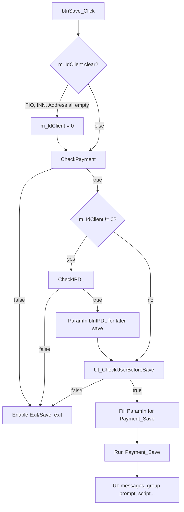

# PLAN: Validation chain architecture — UbsPsUtPaymentGroupFrm

Source: `legacy-form\UtPaymentGroup\UtPaymentGroup_F.dob` (`btnSave_Click`, `CheckPayment`, `CheckTerror`, `Ut_CheckUserBeforeSave`, `CheckRS`, `GetBankNameACC`, `CheckLockPassport`, `CheckIPDL`).  
Channel details: `memory-bank/creative/creative-ubspsutpaymentgroupfrm-channel-contract.md`.

## 1. Design goals (.NET)

- **Preserve order** of checks and **same user-visible messages** (move literals to `Constants.cs`).
- **Preserve UI feedback**: switch to main or additional tab and set focus like VB6 (`SelectTab`, `Focus`).
- **Isolate** validation in **`UbsPsUtPaymentGroupFrm.Save.cs`** (or `*.Validation.cs` if the file grows). **`Keys.cs`** owns Enter-key path that calls `CheckRS` + channel calls.
- Use **`try` / `catch` → `this.Ubs_ShowError(ex)`** on outer handlers; inner checks return `bool` or structured result.
- **`CheckPayment`** in VB6 creates **new** `IUbsParam` instances at entry; after migration, **clear** or use fresh param bags per call so prior `ParamIn` state does not leak.

## 2. Save button pipeline (top level)

**VB6 details:**

- Before `CheckPayment`: if payer FIO, INN, and address are all empty → `m_IdClient = 0`.
- Buttons: disable Save/Exit at start of save attempt; re-enable on validation failure or after branch completion (see legacy error paths).

## 3. `CheckPayment` internal chain (strict order)

| Step | Check | Type | On failure |
|------|--------|------|------------|
| 1 | `CheckLockPassport` | COM `UbsComCheck.CommonCheckPassport4GISMU` (only if doc series/number non-empty) | Return false; no tab change in VB6 |
| 2 | `intState == 1` | Local (contract state from `UtReadContract`) | MsgBox «Не выбран договор с получателем!»; **main tab**; focus `cmbCode` |
| 3 | `m_IdContract == 0` | Local | Same message; **main tab**; focus `cmbCode` |
| 4 | `CheckTerror` | Channel `CheckTerror` | Return false (see §4) |
| 5 | `txtFIOPay` empty | Local | MsgBox «Введите ФИО плательщика.»; **main tab**; focus `txtFIOPay` |
| 6 | `GetBankNameACC` | Channel chain (§5) | **Main tab**; focus `txtBic` if enabled |
| 7 | `UtCheckAccFromBic` | Channel | Show `strError`; **main tab**; focus `ucaAccClient` or `cmbCode` |
| 8 | `curSumma == 0` | Local | «Некорректная сумма платежа!»; **main tab**; focus sum control |
| 9 | `curSummaTotal < 0` | Local | «Некорректная общая сумма платежа!»; **main tab**; focus sum control |
| 10 | `CheckAddFields` | Channel | «Проверка доп. полей»; **additional-properties tab**; no explicit `SetFocus` in VB6 |

**Note:** Step 2 uses the same user message as step 3 in VB6 even though step 2 is “contract closed” (`State == 1`). Keep parity unless product owners request a wording fix.

## 4. `CheckTerror` (channel + UI)

1. Clear params; set `NAME`, `IDCONTRACT`, `PURPOSE`, `RECIPIENTNAME`.
2. `Run("CheckTerror")`.
3. If `RETVAL` missing → treat as pass (exit success).
4. If `RETVAL` is true → pass.
5. If `RETVAL` is false:
   - `MsgBox(StrError, OKCancel)`; **Cancel** → return false.
   - **OK** → set `blnTerror = true`; if `m_IdClient == 0` and `blnErrorPayer` exists → **main tab**, focus `btnClient`, show second message, call `btnClient_Click`, return false.

**.NET:** Keep field `m_blnTerror` (or equivalent) for `Payment_Save` input.

## 5. `GetBankNameACC` sub-chain (called from `CheckPayment`)

Order must not change:

1. `UtCheckBIKBank` — if not `bRetVal`, optionally show `strError` when `m_blnNoMessage` is true; return false.
2. `UtCheckBIKLimitSharing` — if not `bRetVal`, Yes/No dialog; **No** clears contract/BIC/accounts/purpose/recipient and returns false.
3. `ReadBankBIK` — fill bank name and corr account from `Parameters` matrix.

## 6. `Ut_CheckUserBeforeSave` (pre-save user script)

1. New param objects (`ToolPubs.IUbsParam` in VB6 → equivalent bag in .NET).
2. `Run("UTListAddRead")` → read `AddFields` matrix; merge dynamic keys into in-params for next call.
3. If `StrCommand == "CHANGE_PART"` set `IDPAYMENT`.
4. Set fixed keys: `IDCONTRACT`, `CODE`, `INN`, `BIC`, `CORRACC`, `ACC`, `IDCLIENT`, `PAYERFIO`, `PAYERINN`, `PAYERADDRESS`, `RECIPIENTNAME`, `PURPOSE`, `SUMMA`, `SUMMARATESEND`, `SUMMATOTAL`.
5. `Run("Ut_CheckBeforeSave")`.
6. Read `Error`, `bRet`:
   - If `bRet` true and `Error` non-empty → Yes/No; **No** → false.
   - If not `bRet` → show `Error`, **disable Save** (`btnSave.Enabled = false`), false.

**.NET:** Mirror disable-save behavior on hard failure.

## 7. `CheckRS` (Enter on settlement account — not inside `CheckPayment`)

Invoked from `UserDocument_KeyPress` when active control is `AccClient` and user presses Enter, after `CheckRS` returns true and `m_IdContract != 0`:

1. `UtReadOurBankBik` → if our BIC equals payer BIC and account is zeros → error «Некорректный расчетный счет!»; **main tab**; focus account or combo.
2. Set `STRACC`, `BIC`, `CORRACC`; `Run("CheckKey")`; if `RETVAL` false → «Некорректный ключ счета!»; **main tab**; focus account.
3. If true → optional `UtGetINNFromLastPayment` / `UtGetKPPUPayerLastPayment` chain (see channel contract).

**.NET:** Implement in `Keys.cs` (or `Initialization.cs` if tied to lost-focus/accept logic); keep **`CheckRS`** as a named private method callable from key handler.

## 8. Supporting state (fields to carry on form)

| Symbol | Role |
|--------|------|
| `m_blnNoMessage` | Suppress some BIK error popups during `GetBankNameACC` when true |
| `intState` | Contract state from `UtReadContract` (`1` = closed) |
| `m_IdContract`, `m_IdClient` | Ids |
| `blnTerror` | User acknowledged terror check |
| `m_strDocSeries`, `m_strDocNumber` | Drive `CheckLockPassport` |
| `StrCommand` | Mode (`ADD`, `GROUP_EDIT`, `CHANGE_PART`, …) |

## 9. Tab index mapping (VB6 → .NET)

- VB6 **`Tabs(1)`** = main («Основные»).
- VB6 **`Tabs(2)`** = additional («Дополнительные свойства»).
- .NET: set `tabPayment.SelectedIndex` to the index of `tabPageMain` / `tabPageAddProperties` (0-based). **CREATIVE/BUILD:** confirm order matches legacy selection calls.

## 10. Optional refactor (not required for parity)

- Extract **`CheckPayment`** steps 2–3 (contract id / state) into **`ValidateContractSelected()`** for readability.
- If **`Save.cs`** exceeds ~800–1000 lines, move §3–§6 into **`UbsPsUtPaymentGroupFrm.Validation.cs`** as `partial` with same class.

## 11. Constants to add (`Constants.cs`)

All `MsgBox` strings from §3–§7 should become `private const string` entries (Russian text unchanged from VB6 unless product requests updates).

---

**Implementation owner:** `UbsPsUtPaymentGroupFrm.Save.cs` (primary), `UbsPsUtPaymentGroupFrm.Keys.cs` (`CheckRS` + Enter path).
